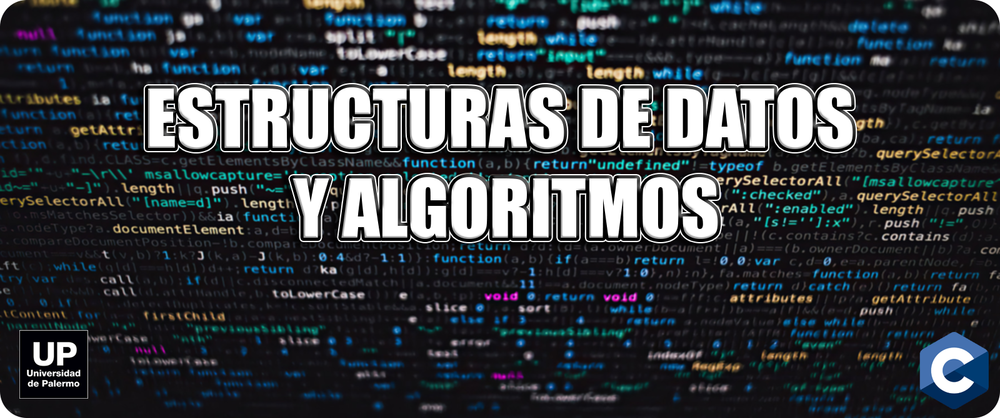

### Repositorio exclusivo para la materia "Estructura de Datos y Algoritmos" de la Universidad de Palermo ([Github](https://github.com/UniversidadDePalermo))

## Contenidos:

* Ejercicios desarrollados en las clases
* Ejecicios resueltos por los alumnos
* Proyectos personales y grupales escritos en C, para compartir
* Practica para el uso de GIT y Github

## Enlaces de interes:

* Descargar [VSCode](https://code.visualstudio.com/)
* Descargar [Code::Blocks](http://www.codeblocks.org/downloads/)
* Descargar [GIT](https://git-scm.com)
* Descargar [Bibliografia](https://repositorio.upct.es/bitstream/handle/10317/1361/iap.pdf?sequence=10&isAllowed=y) oficial de la materia
* IDEs: [Onlinegdb (recomendado)](https://www.onlinegdb.com/online_c_compiler), [Programiz](https://www.programiz.com/c-programming/online-compiler/), [Replit](https://replit.com/languages/c)

### **Unite a nuestro Discord!**

  
